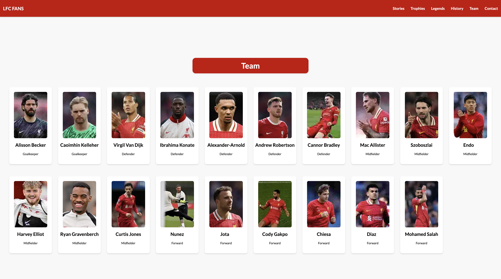

# LFC Fan Page

## Project Description

The ultimate page for fans to come and find history about the club, showing all titles that have been won and show all Liverpool Football Club Legends, Also tell you the stories that has happend!

## Contents

  - [Rationale](#contents)
    - [Main Purpose](#main-purpose)
    - [User Goals](#user-goals)
    - [User Stories](#user-stories)
    - [Website Goals & Objectives](#website-goals-and-objectives)
    - [Target Audience](#target-audience)
    - [Future Improvements](#future-improvements)

- [Wireframes](#wireframes)
  - [Changes](#changes)
- [Designs](#designs)
  - [Typography](#typography)
  - [Colors](#colors)
- [Technologies Used](#Technologies-used)
  - [Languages](#languages)
  - [Libraries](#libraries)
  - [Tools](#tools)
- [Testing](#testing)
  - [Bugs Fixed](#bugs)
  - [Responsiveness Tests](#responsiveness-tests)
  - [Code Validation](#code-validation)
    - [HTML](#html)
    - [CSS](#css)
    - [JS](#js-validation)
    - [Lighthouse Testing](#lighthouse-testing)
- [Features](#features)
  - [Navigation](#navigation)
  - [Content Sections](#content-sections)
  - [User Experience](#user-experience)
  - [Technical Features](#technical-features)
- [Deployment](#deployment)
  - [To deploy project](#to-deploy-the-project)
  - [To fork project](#to-fork-the-project)
  - [to clone project](#to-clone-the-project)
- [Finished Screenshots](#finished-screenshots)
- [Credits](#credits)

## Main Purpose

- To create a fan page for Liverpool FC Supports.
- To provide comprehensive historical information about the club.
- To showcase all titles and trophies won by the club.
- To highlight Liverpool FC legends

[Back to the Top](#contents)

## User Goals

- User friendly navigation.
- User accessibility needs.
- Clear information written all in English.
- Make sure all the data is correct.
- Easy to read.
- Make sure each section is clear.

[Back to the Top](#contents)

## User Stories

- As a user, I want to see correct stories.
- As a user, I want to see it working on all devices.
- As a user, I want a clear navigation.
- As a user, I want it clear what trophies they have won.
- As a user, I want the content to be accessible with anyone with needs.
- As a user, I want all the sections to be easy to understand.
- As a user, I want to learn something new.
- As a user, I want to find more history about the club.
- As a user, I want to see the team.

[Back to the Top](#contents)

## Website Goals and Objectives

- Provide correct information for fans to see.
- Make it enjoyable to read.
- Adding all the club trophies, club legends, club stories.
- Making sure everyone can access it with people have needs.
- Attract wide audience like fans from all around the world.
- Allow fans to contact us about adding information or getting information about the club.
- Make it easy to navigate and find different sections.

[Back to the Top](#contents)

## Target Audience

- Liverpool Fans.
- Casual Viewers.

[Back to the Top](#contents)

## Wireframes

Wireframes was designed by using Balsamiq Wireframes, I followed best practice by doing Mobile version first then Tablet then follow with Desktop.

[Mobile Wireframe](docs/wireframes/Mobile.png "Mobile Wireframe")

[Tablet Wireframe](docs/wireframes/Tablet.png "Tablet Wireframe")

[Desktop Wireframe](docs/wireframes/Desktop.png "Desktop Wireframe")

[Back to the Top](#contents)

## Designs

I have chosen these colors and font because it matches the Liverpool FC color scheme.

## Typography

The font family I have choosen is [Lato](https://fonts.google.com/specimen/Lato, "Lato") because it makes it feel modern while matching the theme.

[Back to the Top](#contents)

## Colors

[Back to the Top](#contents)

### Color Variables
| Variables          | Color (HEX) | Notes                                                                                                     |
| ------------------ | ----------- | --------------------------------------------------------------------------------------------------------- |
| \--primary-color   | #C70000     | This is used in Navbar, Footer, Buttons as this is the main color for the website.                        |
| \--secondary-color | #F8F8F8     | This is used in the background color to make it standout to any other colors.                             |
| \--darker-primary-color | #8B0303     | This is used in the buttons background and section title where the red is darker for a better contrast.                             |
| \--white           | #FFF        | This is used in Text, Cards, Buttons everywhere that contains white color because thats the main purpose. |
| \--black           | #000        | This is used in Text also can be used in anything else that you want black.                               |

## Technologies Used

### Languages

- HTML
- CSS
- JavaScript

[Back to the Top](#contents)

### Libraries

- Google Fonts
- FontAwesome

[Back to the Top](#contents)

### Tools

- Github
- Balsamiq
- CDNJS
- Am I Responsive
- WAVE Accessibility Tool
- CompressNow
- LightHouse
- W3C HTML Validation Service
- W3C CSS Validation Service

[Back to the Top](#contents)

## Future Improvements

- [ ] Add more interactive features.
- [ ] Implement dark mode.
- [ ] Add more historical content
- [ ] Add a FAQ section.

[Back to the Top](#contents)

## Changes

- I had to make a few changes from the wireframe since I made the design wide and forget to consider how it would look.
- Color changes to make it better for contrast.
- I've changed the flow of the website I was suppose to have trophies left to right row since it looks nice I think making it basic looks and feels better.

[Back to the Top](#contents)

## Features

### Navigation

- Responsive navigation bar with hamburger menu for mobile devices
- Smooth scrolling to different sections
- Clear and intuitive menu structure

[Back to the Top](#contents)

### Content Sections

- Hero section with call-to-action
- Stories section showcasing iconic Liverpool FC moments
- Trophies section displaying all club achievements
- Legends section featuring club icons
- History section with timeline of important events
- Current team roster with player information
- Contact form for user interaction

[Back to the Top](#contents)

### User Experience

- Responsive design (Mobile, Tablet, Desktop)
- Accessible navigation and content
- Clear typography using Lato font
- Liverpool FC color scheme integration
- Interactive elements (hover effects, buttons)
- Form validation for contact section

[Back to the Top](#contents)

### Technical Features

- Mobile-first approach
- Cross-browser compatibility
- Fast loading times
- SEO-friendly structure
- Social media integration
- Contact form with FormSubmit.co integration

[Back to the Top](#contents)

## Testing

### Bugs
I made sure to test each section when I was adding it and after everything was done so I could make sure there was no issues.
| Bug                                      | Status | Description                                                                           | Steps To Resolve                                                                                                                     |
| ---------------------------------------- | ------ | ------------------------------------------------------------------------------------- | ------------------------------------------------------------------------------------------------------------------------------------ |
| Performance was low due to images sizes. | Fixed  | Images was too big and causing to load slower.                                        | I compressed the images and used loading="lazy" on the images to fix this issue.                                                     |
| Website Responsive.                      | Fixed  | I took a different approach to make the website more responsive and use less code.    | I made reusable classes and used mobile first so I only had to use 1 media query for laptop and bigger.                              |
| Form Validation and sending email.       | Fixed  | The form wasn't working with mailto so I had to use a 3rd party system to send email. | I fixed this by using a 3rd party system called [https://formsubmit.co/](https://formsubmit.co/) which works way better and simpler. |

[Back to the Top](#contents)

### Responsiveness Tests
To test responsiveness I made sure to use mobile first approach and kept testing it using developer tools then after it was done I used [Responsive Design Checker](https://responsivedesignchecker.com/) to make sure it worked on multiple devices.

[Back to the Top](#contents)

When I was developing the website I was using Google Chromes Mobile Simulator to make sure it was working correctly and I have made it responsive by aligning each section and allowing the text and images to shirk to able to see and fit correctly.
| Size | Device Example          | Navigation | Element Alignments | Content Placement | Functionality | Notes                                                    |
| ---- | ----------------------- | ---------- | ------------------ | ----------------- | ------------- | -------------------------------------------------------- |
| sm   | Apple Iphone 3/4/4's    | Good       | Good               | Good              | Good          |                                                          |
| sm   | Samsung Galaxy S5/S6/S7 | Good       | Good               | Good              | Good          |                                                          |
| sm   | Google Pixel            | Good       | Good               | Good              | Good          |                                                          |
| md   | Ipad Mini               | Good       | Good               | Good              | Good          |                                                          |
| md   | Samsung Galaxy Tab 10   | Good       | Good               | Good              | Good          |                                                          |
| md   | Amazon Kindle           | Good       | Good               | Good              | Good          |                                                          |
| lg   | 10 Inch Notebook        | Good       | Good               | Good              | Good          |                                                          |
| lg   | 15 Inch Notebook        | Good       | Good               | Good              | Good          |                                                          |
| xl   | 20 Inch Desktop         | Good       | Good               | Good              | Good          |                                                          |
| xl   | 24 Inch Desktop         | Good       | Good               | Good              | Good          | Make the contact form stand out more for bigger screens. |

[Back to the Top](#contents)

## Code Validation

### HTML
I have used [W3C HTML Validation](https://validator.w3.org/). I have tested my 1 HTML page and came back with no errors.

[Back to the Top](#contents)

### CSS
The CSS code was validated by using [W3C CSS Validation](https://jigsaw.w3.org/css-validator/). It returned back no errors just 1 warning.

[Back to the Top](#contents)

### JS Validation
The JS code was validated by using [JSHint](https://jshint.com/). It returned back no errors just a few warnings for forms and being unsued but it's being used in the index.html

[Back to the Top](#contents)

### Accessibility Testing
I have used [WAVE](https://wave.webaim.org/) for accessibility testing I had no errors or alerts.

[Back to the Top](#contents)

## Lighthouse Testing
I have used Lighthouse to test Perfomance, Accessibility, Best Practices, SEO

### Mobile 

### Desktop

[Back to the Top](#contents)

## Deployment

### To deploy the project
LFC App was deployed using Github pages if you want to do the same follow these simple steps.

- Navigate to the repository on GitHub and click on Settings.
- In the side navigation and select Pages.
- In the None dropdown and choose Main.
- Click on the Save button.
- The website is now live!
[Back to the Top](#contents)

## To fork the project
Forking the GitHub repository allows you to create a duplicate of a local repository. This is done so that modifications to the copy can be performed without compromising the original repository.

- Log in to GitHub.
- Locate the repository.
- Click to open it.
- The fork button is located on the right side of the repository menu.
- To copy the repository to your GitHub account, click the button.

## To clone the project

- Log in to GitHub.
- Navigate to the main page of the repository and click Code.
- Copy the URL for the repository.
- Open your local IDE.
- Change the current working directory to the location where you want the cloned directory.
- Type git clone, and then paste the URL you copied earlier.
- Press Enter to create your local clone.

[Back to the Top](#contents)

## Finished Screenshots

### Hero Section

### Stories Section

### Trophies Section

### Legends Section

### History Section

### Team Section

### Contact Section

## Credits

- Feedback and Support
  - [Simen Daehlin](https://github.com/Eventyret)
- Images
  - [Liverpool FC](https://liverpoolfc.com/)

[Back to the Top](#contents)
